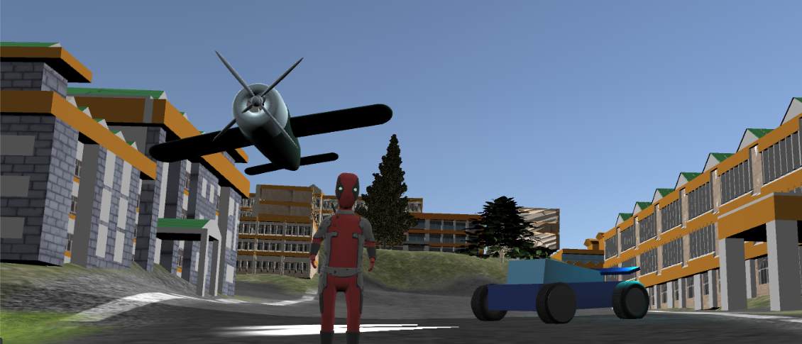

# PROJECT TITLE:   RollOnHills
# AUTHORS:         Sckorpio
# VERSION or DATE: March,2018

# DESCRIPTION:
                       (Note:- The project is on its initial state)
                       NITH - RollOnHills is an Open Source action-adventure third-person video game 
                       developed by DeltaForce based on NIT Hamirpur.
                       It is a third person game ie.,player can roam in the campus anywhere
                       Can drive the car
                       Fly the Plane
                       and many misssions
                                             
# LINKS:      
https://www.facebook.com/NITHRollOnHills/

  https://www.facebook.com/NITHRollOnHills/videos/2087815061246050/

# TECHNOLOGY USED: 
                     -- Unity
                     -- C# Scripting
                     -- Blender
                     -- Image Processing
                     -- Game theory
                     -- Android
                     
# USER INSTRUCTIONS: -- 
                      -- The game can be played on Linux by downloading the build file.
                      -- Download the android build file and transfer to phone and play.
                     
                       
                    
